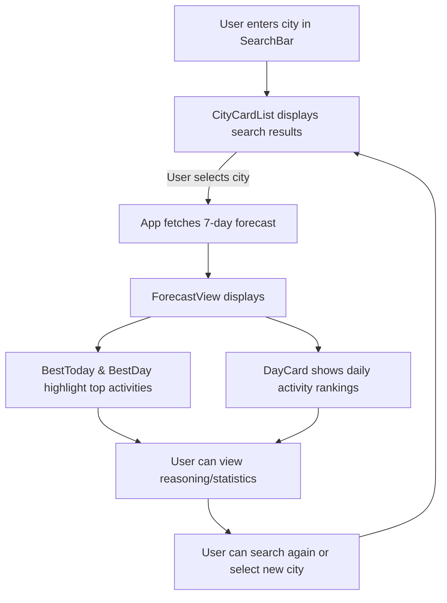
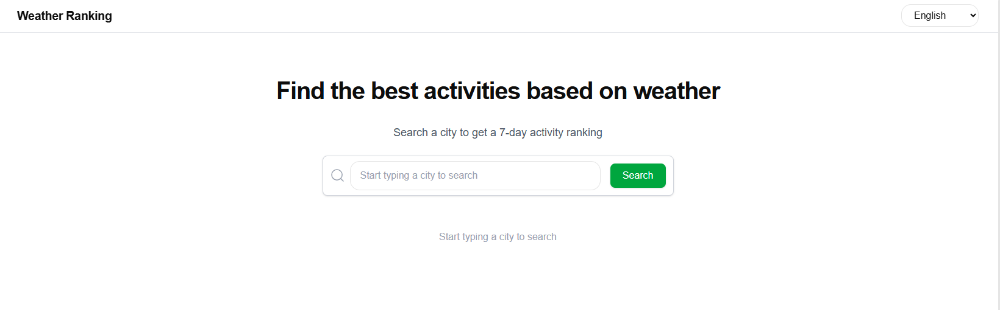
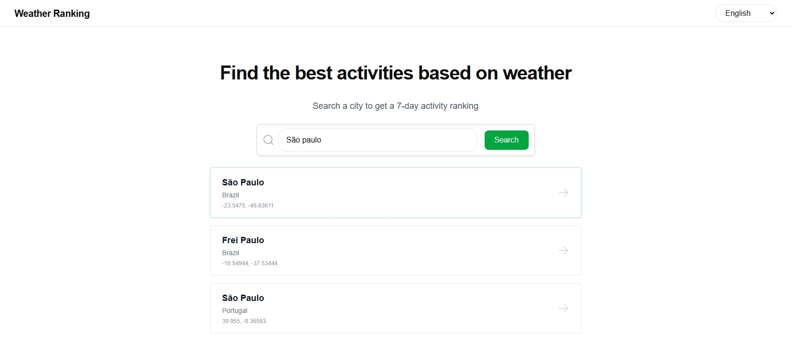
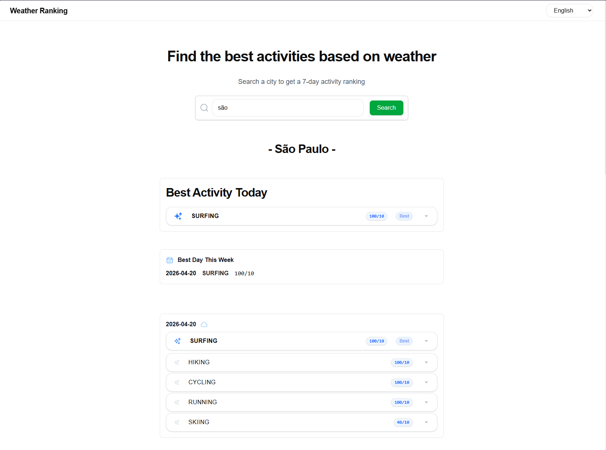

# Weather Ranking App — Web Frontend

Next.js 15 frontend for ranking activities by weather, powered by a GraphQL API. Modern, responsive, and visually distinctive, this app helps users find the best activities for any city, any week.

---

## 🧭 App Flow

The app guides users from searching for a city to discovering the best activities for each day, using a clear, interactive flow:

1. **Search:** User enters a city name in the SearchBar.
2. **Select:** CityCardList displays matching cities; user selects one.
3. **Fetch:** The app fetches a 7-day weather forecast for the selected city.
4. **View:** ForecastView shows:
    - **BestToday** and **BestDay**: Instantly highlight the top activity for today and the best day of the week.
    - **DayCard**: Ranks activities for each day based on weather.
    - **Reasoning/Stats**: Users can view why an activity is ranked best.
5. **Repeat:** User can search again or select a new city at any time.

### App Flow Diagram



---

## 🚀 Features

- **City Search:** Find cities worldwide and get tailored activity recommendations.
- **7-Day Forecast:** See a ranked list of activities for each day, based on weather data.
- **Best Today & Best Day:** Instantly spot the top activity for today and the best day of the week.
- **Interactive UI:** Fast, animated, and mobile-friendly interface.
- **Design System:** Custom theme inspired by Airtable, with semantic tokens and modern UI patterns.
- **i18n Support:** Multi-language ready using `react-i18next`.
- **TypeScript:** End-to-end type safety.

---

## 🖥️ UI Previews

Below are screenshots of the main UI assets:

### Home


### Search


### Results


---

## 🏗️ Project Structure

```
src/
├── app/
│   ├── components/         # UI components (cards, lists, icons, etc.)
│   ├── services/           # API and data fetching logic
│   ├── utils/              # Forecast processing and helpers
│   ├── locales/            # i18n translation files
│   ├── globals.css         # Tailwind and theme tokens
│   └── page.tsx            # Home page entry
├── assets/                 # UI screenshots and static assets
lib/                        # GraphQL client setup
```

---

## ⚡ Quickstart

1. **Install dependencies** (from the monorepo root):
    ```bash
    npm install
    ```
2. **Run the app in development:**
    ```bash
    npm run dev
    ```
    The app will be available at [http://localhost:3001](http://localhost:3001).
3. **Build for production:**
    ```bash
    npm run build
    npm run start
    ```

---

## 🌐 API & Environment

By default, the frontend communicates with the GraphQL API at `http://localhost:3000/graphql`.
You can configure this via environment variables:

```bash
# .env.local
NEXT_PUBLIC_API_URL=http://localhost:3000/graphql
```

---

## 🛡️ Environment Setup

1. **Copy the example environment file:**
   Copy and paste the following into a new file named `.env.local` in the project root:

   ```env
# .env.local (example)
NEXT_PUBLIC_GRAPHQL_API_URL=https://your-graphql-api-url.com/graphql
NEXT_PUBLIC_I18N_DEFAULT_LOCALE=en
NEXT_PUBLIC_I18N_SUPPORTED_LOCALES=en,es,pt
   ```

   Or, run:
   ```bash
   cp .env.example .env.local
   ```

2. **Edit the values** as needed for your environment (API URL, locales, etc).

---

## 🎨 Design & Theming

- Follows the [DESIGN.md](DESIGN.md) system: deep navy text, Airtable blue CTAs, Haas font, generous radii, and blue-tinted shadows.
- Uses semantic theme tokens in `globals.css` for consistent styling.
- All UI built with Tailwind CSS and React components.

---

## 🌍 Internationalization (i18n)

- Uses `react-i18next` for all user-facing text.
- Translation files are in `src/app/locales/` (English, Spanish, Portuguese, etc).
- To add a language, create a new folder and add a `common.json` file.

---

## 🧩 Main UI Flow

1. **Search for a city** using the search bar.
2. **Select a city** from the results to view its 7-day activity forecast.
3. **Review the best activity for today** and the best day of the week.
4. **Browse daily cards** for detailed activity rankings and reasoning.

---

## 🛠️ Linting & Formatting

Run lint checks with:
```bash
npm run lint
```
Formatting is handled by Prettier and ESLint (see config files).

---

## 🤝 Contributing

Contributions are welcome! To propose a change:
- Fork the repo and create a feature branch.
- Follow the design and code conventions (see DESIGN.md).
- Ensure your code passes lint and build checks.
- Open a pull request with a clear description.

---

## 💬 Support & Feedback

For bugs, feature requests, or questions, open an issue or contact the maintainers.

---

## 📄 License

This project is licensed under the MIT License.


## 💻 Frontend Improvements

### Testing Strategy
- Fix test setup issues (`@testing-library/react`)
- Add unit tests for components and hooks
- Introduce integration tests with mocked GraphQL responses

### Architecture & Maintainability
- Introduce a data-fetching layer (e.g., React Query or Apollo Client cache)
- Improve separation between UI and data logic
- Evolve folder structure for scalability

### User Experience
- Add loading states (skeletons/spinners)
- Improve error feedback
- Enhance input validation UX

### Performance
- Reduce unnecessary re-renders
- Apply memoization where appropriate
- Improve async handling (debounce, request cancellation)

### Internationalization
- Expand translation coverage
- Lazy-load translations
- Add fallback strategies
- Support server-side translations where applicable

## 📚 Further Reading

- [Frontend README](apps/web/README.md)
- [Backend README](apps/api/README.md)
- [Shared Types](packages/types/src/index.ts)