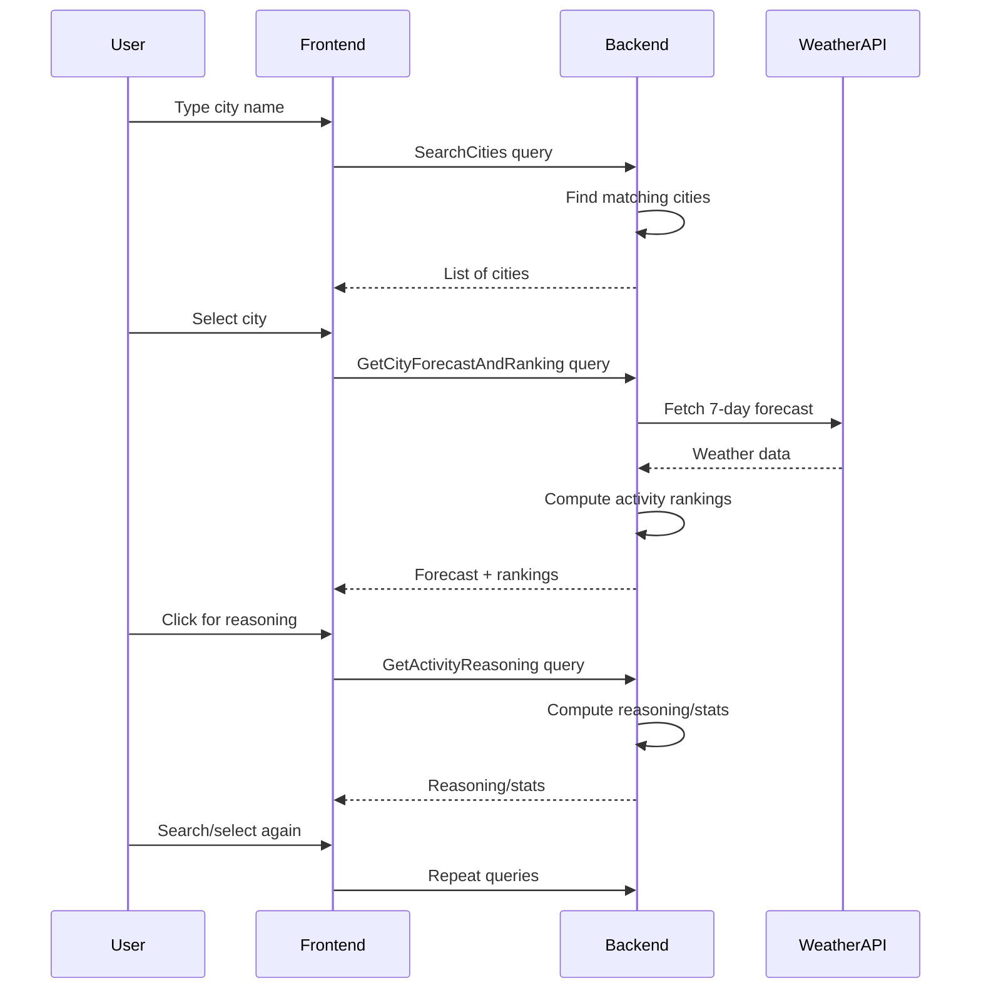

# Weather Ranking App — End-to-End Query Flow

This page explains, step by step, how the frontend and backend interact in the Weather Ranking App. It covers which GraphQL queries are called, how data flows through the system, and which components and services are involved.

---

## 🗺️ High-Level Architecture

```mermaid
flowchart LR
		User[User (Browser)]
		Web[Next.js Frontend]
		API[NestJS GraphQL API]
		WeatherAPI[(Weather Data Source)]
		User -->|HTTP| Web
		Web -->|GraphQL| API
		API -->|Fetch/Process| WeatherAPI
```

---

## 1. Search for a City

### Frontend

- **Component:** `SearchBar` (`src/app/components/SearchBar.tsx`)
- **Action:** User types a city name.
- **Query:** Sends a GraphQL query to the backend to search for cities.

```graphql
query SearchCities($name: String!) {
	cities(name: $name) {
		id
		name
		country
		lat
		lon
	}
}
```

- **Where:** Called in a service or hook (e.g., `src/app/services/` or directly in a component).

---

### Backend

- **Resolver:** `CityResolver` (`apps/api/src/city/city.resolver.ts`)
- **Service:** `CityService` (`apps/api/src/city/city.service.ts`)
- **Flow:**
	1. `cities` query is received by the resolver.
	2. Resolver calls the service to fetch matching cities (from a DB or external API).
	3. Returns a list of city objects.

---

## 2. Select a City & Fetch Forecast

### Frontend

- **Component:** `CityCardList` (`src/app/components/CityCardList.tsx`)
- **Action:** User clicks a city card.
- **Query:** Fetches a 7-day weather forecast and activity rankings for the selected city.

```graphql
query GetCityForecastAndRanking($cityId: ID!) {
	city(id: $cityId) {
		id
		name
		forecast {
			date
			weather {
				temperature
				precipitation
				wind
				# ...other weather fields
			}
			activityRankings {
				activity
				score
				reasoning
			}
		}
	}
}
```

- **Where:** Called in a service (e.g., `src/app/services/`) or in a data-fetching server component.

---

### Backend

- **Resolver:** `CityResolver` or `WeatherResolver` (`apps/api/src/city/city.resolver.ts` or `apps/api/src/weather/weather.resolver.ts`)
- **Services:** `WeatherService`, `RankingService`
- **Flow:**
	1. `city` query is received; resolver fetches city details.
	2. Resolver calls `WeatherService` to fetch a 7-day forecast for the city.
	3. For each day, `RankingService` computes activity rankings based on weather.
	4. Returns forecast and rankings for each day.

---

## 3. View Results

- **Components:** `ForecastView`, `BestToday`, `BestDay`, `DayCard`
- **Action:** UI displays:
	- Best activity for today (`BestToday`)
	- Best day of the week (`BestDay`)
	- Ranked activities for each day (`DayCard`)
	- Reasoning/statistics for rankings

---

## 4. View Reasoning/Stats (Optional)

### Frontend

- **Component:** `DayCard`, `BestToday`, `BestDay`
- **Action:** User clicks to view why an activity is ranked best.
- **Query:** May trigger a more detailed query for reasoning (if not already fetched).

```graphql
query GetActivityReasoning($cityId: ID!, $date: String!, $activity: String!) {
	activityReasoning(cityId: $cityId, date: $date, activity: $activity) {
		reasoning
		stats
	}
}
```

---

### Backend

- **Resolver:** `RankingResolver` (`apps/api/src/ranking/ranking.resolver.ts`)
- **Service:** `RankingService`
- **Flow:**
	1. `activityReasoning` query is received.
	2. Service computes or retrieves detailed reasoning/statistics for the activity on the given day.
	3. Returns reasoning and stats.

---

## 5. Search Again or Select New City

- **Component:** `SearchBar`, `CityCardList`
- **Action:** User can repeat the flow, triggering the above queries again.

---

## 🔄 Sequence Diagram



---

## 📋 Summary Table

| Step | Frontend Query | Backend Resolver | Service(s) Involved | Purpose |
|------|---------------|------------------|---------------------|---------|
| 1    | `cities`      | `CityResolver`   | `CityService`       | Search for cities |
| 2    | `city`        | `CityResolver`/`WeatherResolver` | `WeatherService`, `RankingService` | Get forecast & rankings |
| 3    | `activityReasoning` (optional) | `RankingResolver` | `RankingService` | Get detailed reasoning/stats |

---

## 🏗️ Project Structure References

- **Frontend:** `apps/web/src/app/`
	- `components/` — UI components
	- `services/` — API and data fetching logic
	- `utils/` — Forecast processing and helpers
	- `lib/graphql-client.ts` — GraphQL client setup
- **Backend:** `apps/api/src/`
	- `city/` — City module, resolver, service
	- `weather/` — Weather module, resolver, service
	- `ranking/` — Ranking module, resolver, service
- **Shared Types:** `packages/types/src/index.ts`

---

## 📚 Further Reading

- [Frontend README](apps/web/README.md)
- [Backend README](apps/api/README.md)
- [Shared Types](packages/types/src/index.ts)

---

This page provides a comprehensive, step-by-step explanation of the full data flow and query handling in the Weather Ranking App. Use it as a study guide for interviews or onboarding!
